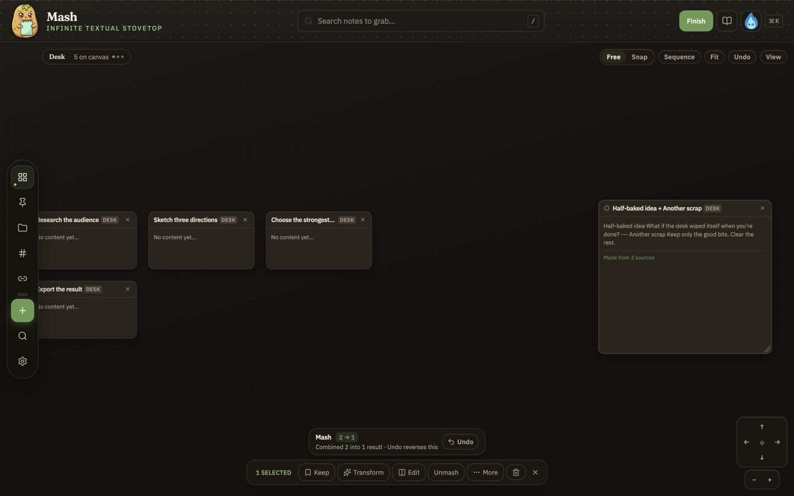
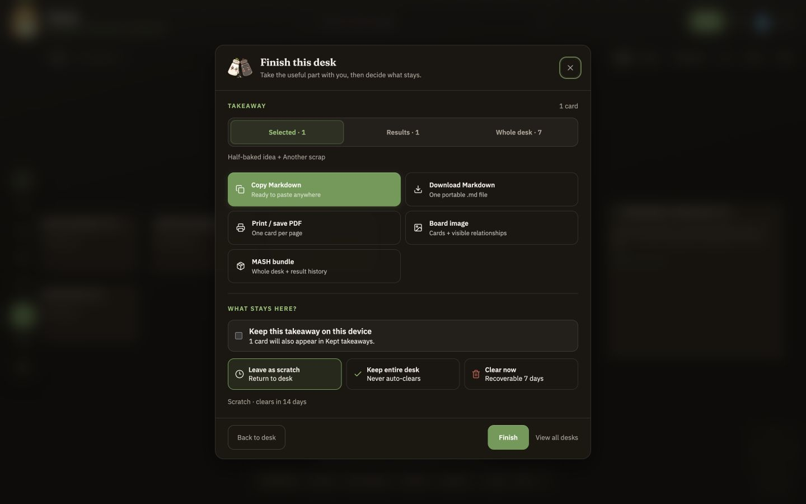

# Mash

**A fast, local-first scratch workbench for turning messy text and files into useful, portable results.**

[](https://github.com/jonnydry/mash-notes/actions/workflows/ci.yml)
[](LICENSE)

Mash is the temporary surface between having a pile of material and knowing what to do with it. Paste, drop, or open content; arrange and transform it on a desk; then copy or export the useful part. There is no account, cloud database, or server-side processing.



## When Mash is useful

Reach for Mash when you need to:

- clean up pasted meeting notes without creating a new project;
- pull useful excerpts from a PDF, Word document, or HTML file;
- compare, combine, split, sort, or deduplicate fragments;
- arrange research, screenshots, or links into a sequence;
- turn CSV/TSV rows into movable cards, or produce Markdown, a PDF, or a board image and continue working elsewhere.

Mash is intentionally a step in a workflow, not another system you have to maintain.

## The core loop

1. **Bring things in** — Paste text, drop files, open documents, or import Markdown.
2. **Shape the set** — Select cards and Mash, split, pack, sort, deduplicate, sequence, or group them.
3. **Take the useful part** — Copy Markdown, download a file, print a PDF, export a board image, or save a desk bundle.
4. **Decide what remains** — Keep the result, leave the desk as temporary scratch work, or clear it with recovery.



## What goes in and what comes out

| Bring in                           | Work with                              | Take away                       |
| ---------------------------------- | -------------------------------------- | ------------------------------- |
| Plain text, Markdown, CSV, and TSV | Mash and Unmash                        | Copy Markdown                   |
| PDF, Word (`.docx`), and HTML      | Split, pack, sort, and deduplicate     | Download Markdown               |
| PNG, JPEG, WebP, and GIF           | Sequence, align, and group             | Print or save PDF               |
| HTTP(S) URLs                       | Reversible operation receipts          | Export board image              |
| Obsidian or Bear Markdown folders  | Tags, folders, links, and kept results | Desk bundle or workspace backup |

Animated GIFs can become a still or an evenly sampled set of frame cards. Pasted URLs become local source cards; Mash does not fetch the remote page.

See [Capabilities](docs/capabilities.md) for the detailed inventory and safety limits.

## Private and local by default

- Notes, desks, images, and operation history live in browser storage on the current device.
- Mash has no application backend, login, analytics, or cloud note service.
- After the first successful load, the installed PWA can reopen with its static application assets offline.
- New desks are scratch workspaces that clear after 14 days of meaningful inactivity by default.
- Cleared scratch desks remain recoverable for 7 days. Kept desks and kept results do not auto-clear.
- Exports remain available when local persistence is unhealthy, so work can still leave Mash.

Browser storage is not an off-device backup. Use **Back up workspace** for a complete portable copy, or export a desk bundle when you only need the active working session.

Read [Privacy and storage](docs/privacy-and-storage.md) for the full trust boundary.

## Quick start

Mash requires Node.js 22 or newer for local development.

```bash
git clone https://github.com/jonnydry/mash-notes.git
cd mash-notes
npm ci
npm run dev
```

Open [http://localhost:5173](http://localhost:5173).

Production builds are static:

```bash
npm run build
npm run preview
```

The deployable site is written to `build/`. It can be hosted on any static host that supports the included SPA fallback and security headers.

## Move work between devices

1. For the complete workspace, open **Settings** or the command palette and choose **Back up workspace…**.
2. On the destination device, choose **Restore workspace backup…**, inspect the preview, and confirm.
3. For one active session instead, use **Export desk bundle…** and **Import desk bundle…**.

This is deliberate file transfer, not background cloud synchronization. Read [File formats](docs/file-formats.md) for compatibility details.

## Browser support

Mash is built as a standards-based PWA. Its baseline workflows use ordinary browser features: paste, drag and drop, file selection, IndexedDB, download, print, and the clipboard when permission is available. Some folder-picking, installation, and operating-system integration features vary by browser.

See [Browser support](docs/browser-support.md) for the tested support policy and fallbacks.

## Development

```bash
npm run lint
npm run check
npm test
npm run build
npm run perf:budget
npm run test:e2e
npm run ci
```

The main quality gate covers formatting, linting, Svelte and TypeScript checks, unit tests, production build, bundle budgets, and Playwright end-to-end tests.

- [Architecture](docs/architecture.md)
- [Contributing](CONTRIBUTING.md)
- [Security policy](SECURITY.md)
- [Changelog](CHANGELOG.md)

## Project status

Mash is preparing its `v0.2.0` Utility Release. The current focus is reliability, safe local file handling, offline behavior, portable exports, and making the workflow understandable without documentation.

## License

Mash is available under the [MIT License](LICENSE).

---

Made with potatoes. Mash responsibly.
