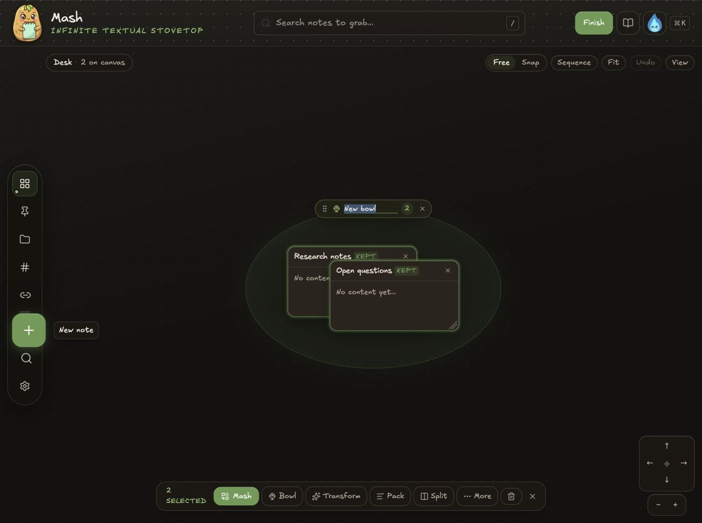

# Bowl mascot integration recommendation

## Scope

Review the current Bowl creation action, on-canvas Bowl treatment, and supplied 256×256 transparent mascot to find a placement that preserves legibility and does not crowd compact controls.

## Verdict

Use the mascot as a first-use Bowl guide, not as the Bowl icon itself.

The best primary placement is a dismissible coachmark anchored beneath the Bowl label immediately after the first Bowl is created. Display the mascot at 72–88px beside two short instructions:

- Drag empty Bowl space to move the whole group.
- Drag a card to rearrange it inside the Bowl.

Keep the existing Lucide Bowl icon in the selection bar and Bowl label. Those controls render around 14px, where the character's face, rice texture, arms, and notepad become visual noise.

## Evidence

### 1. Bowl created — mixed health

Strengths:

- The circular wash already creates a clear feature-owned region.
- The top label is the natural anchor for Bowl identity and instructions.
- The selected-notes action bar keeps Bowl discoverable alongside Mash and Transform.

Risks:

- The label and selection bar are too compact for a detailed raster mascot.
- A persistent image inside the circular region could overlap notes or compete with user content.
- Replacing the line icon with a tiny raster would reduce clarity and create inconsistent icon weight.

## Recommended behavior

1. On the user's first successful Bowl creation, show a compact coachmark below the Bowl label.
2. Use the mascot at 72–88px, never below 56px.
3. Include a single “Got it” action and allow Escape to dismiss.
4. Store dismissal locally so it does not recur on every Bowl.
5. Keep the existing hover hint for repeat use after onboarding is dismissed.
6. If Mash later gains a Bowl inspector or overview, reuse the mascot at 80–96px in that panel header.

## Accessibility considerations

- Treat the mascot as decorative (`alt=""`) because adjacent text communicates the instructions.
- Move focus to the coachmark only if it behaves as a dialog; otherwise announce it with a polite status region and leave focus on the Bowl name.
- The coachmark must be dismissible by keyboard and must not cover the Bowl name or selected cards at 200% zoom.

## Asset guidance

- Source: 256×256 RGBA PNG with transparency.
- Suggested project name: `static/icons/Rotating Icons/bowl-guide.png`.
- Ideal display size: 72–88px for the first-use coachmark.
- Minimum display size: 56px.
- Do not use the full mascot at toolbar or inline-label size.
