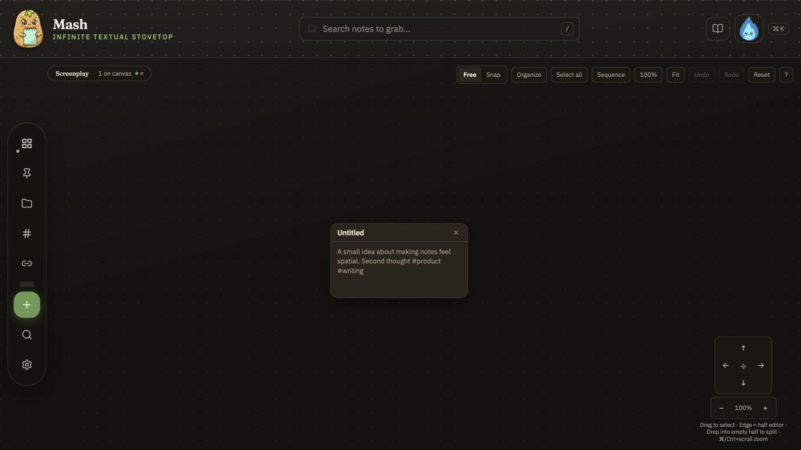
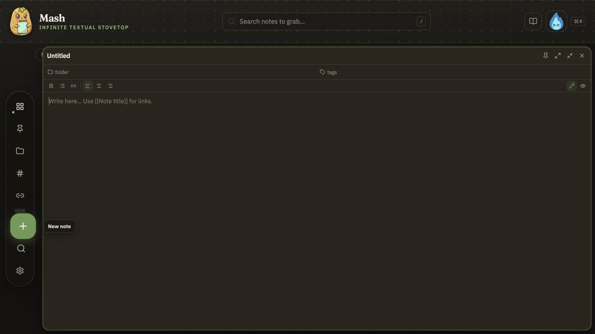
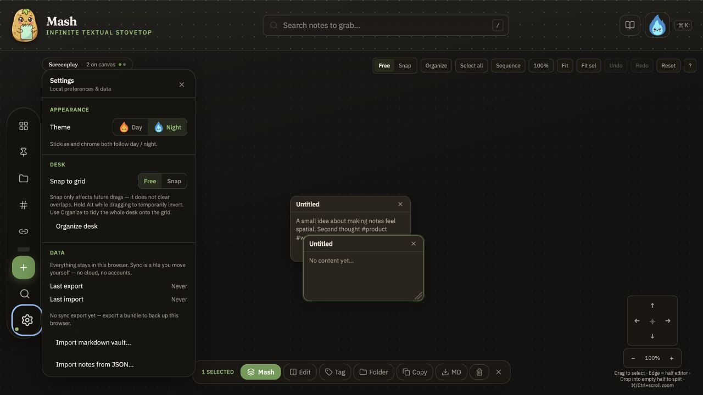
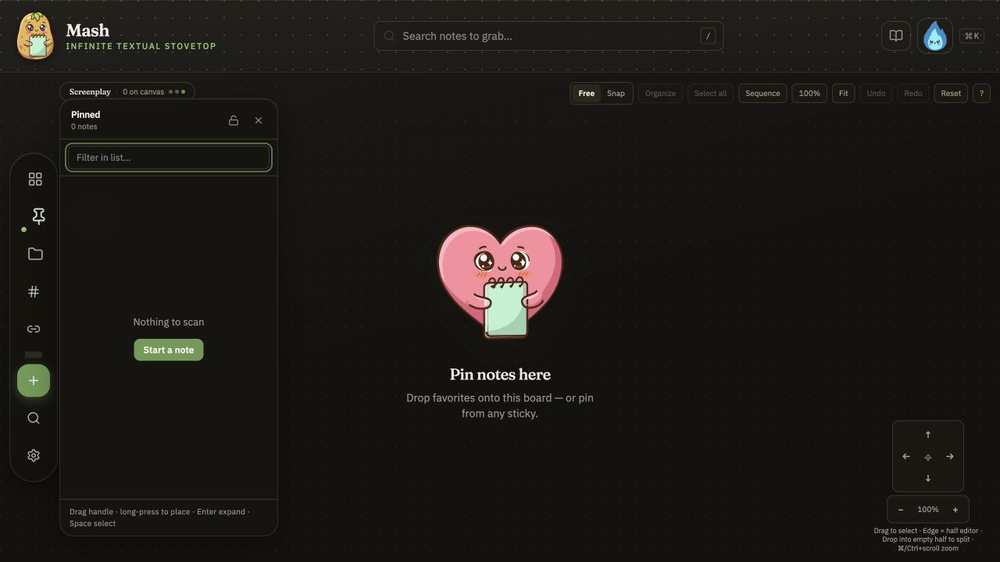
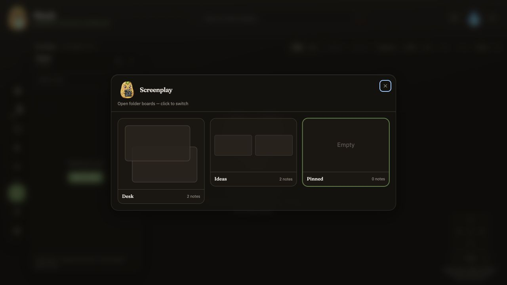
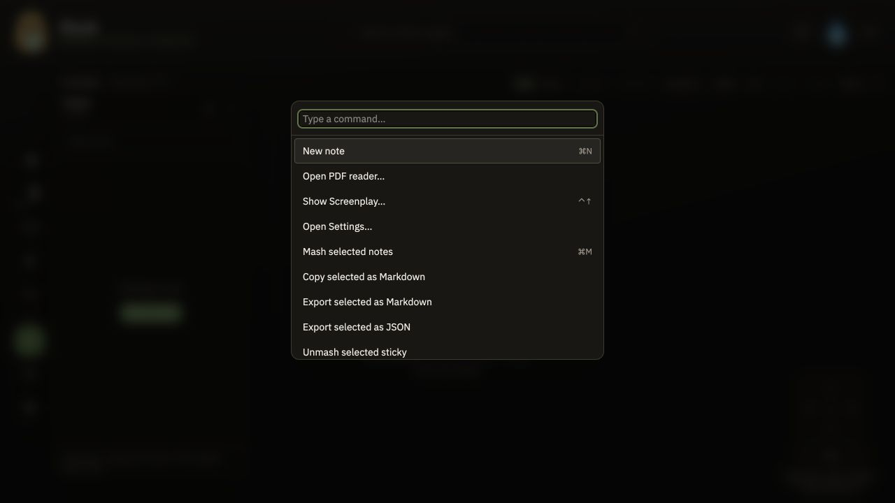
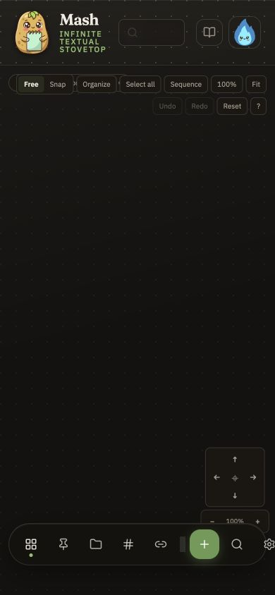
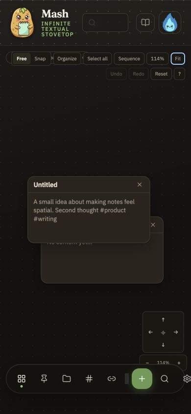

# MASH product and engineering review

Date: 2026-07-10

## Executive view

MASH is strongest when it feels like a workbench: throw material onto a desk, move it around, combine it, and leave with something useful. The product already has a distinctive interaction vocabulary and much more depth than a typical local notes prototype.

The biggest opportunity is to commit to an ephemeral promise. Today every scratch becomes a durable `Note`, every board is tied to a folder or special collection, and the product reminds people to back up. That makes MASH feel like a notes repository with a canvas. A more differentiated product would feel like a **session compiler**:

> Bring things in → shape a set → transform it → take the result → clear or let the desk expire.

## What is already working

- The visual identity is memorable, warm, and coherent without looking toy-like.
- Local-first storage, file import, Markdown export, sync bundles, and offline support create a credible privacy story.
- Canvas mechanics are deep: pan, zoom, snap, arrange, selection, sequence, split editing, links, and reversible Mash/Unmash.
- The selection bar gives contextual actions at the right moment.
- Keyboard users have a substantial command surface and the DOM has generally thoughtful roles, labels, and focus styles.
- The engineering baseline is healthy: `svelte-check` passes, the production build passes, and 169 unit tests pass.

## Highest-impact product changes

### 1. Make a session a real object

The current model has notes, folder canvases, and a pinned canvas, but no first-class session. Add a lightweight session/desk lifecycle:

- `New desk` starts clean without asking for a name.
- The last desk can be resumed after a crash or accidental close.
- Scratch desks expire after a chosen period unless kept.
- `Finish session` offers Copy result, Export, Keep selected, or Discard all.
- Show recent desks as crash recovery, not as a permanent knowledge library.

This is the architectural change that makes the product match the intended behavior.

### 2. Separate scratch fragments from saved notes

Creating a card currently creates a durable `Note` in IndexedDB. Introduce a transient `Fragment` or `Card` that belongs to a session. A user can explicitly promote a result to `Kept`, `Pinned`, or a reusable note. This prevents the tray, folders, tags, and search from filling with one-off scraps.

### 3. Put universal intake in the empty desk

MASH supports several imports, but the primary surface does not clearly invite them. The empty desk should say something like:

> Paste text, drop files, or start typing.

Useful intake behaviors:

- Paste bullets or lines and choose `one card per line`, `one card per paragraph`, or `single card`.
- Drop Markdown, text, PDFs, CSV/TSV, or multiple files as a set.
- Paste a URL as a source card with title and provenance.
- Preserve source information without forcing folders or tags.

### 4. Turn Mash into a family of set operators

Combining notes is good, but “quick manipulation of sets” can become the real moat. After selecting cards, offer a small operator menu:

- Combine, split, stack, group, sort, deduplicate, sequence, compare, rank, vote, randomize, and cluster.
- Save repeatable transformations as `recipes`, not templates for long-term storage.
- Keep every operation reversible and show a compact receipt: inputs, action, output.
- If AI is added, make it an optional operator alongside deterministic ones, with explicit input/output and no hidden retention.

### 5. Design an exit, not a backup workflow

The app currently emphasizes JSON and sync bundles in Settings. For an ephemeral product, the emotionally important moment is finishing:

- A persistent `Take it with you` action should offer Copy, Markdown, PDF, board image, or a static local bundle.
- The finish flow should make it easy to keep only the result and discard the ingredients.
- Backup reminders should appear only when the user has created meaningful work, not as a standing storage obligation.

### 6. Reduce permanent chrome

The desktop toolbar exposes placement mode, organization, selection, sequencing, zoom, fit, undo, redo, reset, and help at once. Keep the desk quiet:

- Default: placement mode and one `View` menu.
- When cards are selected: selection and set operators.
- When sequence mode is active: sequence-specific controls.
- Put rare pan/zoom actions into gestures, shortcuts, or one compact control.

### 7. Make the playful language self-teaching

`Mash`, `Peel`, and `Screenplay` are delightful but require interpretation. Teach them through one-session actions, not documentation:

- A first desk with three disposable ingredients and a prompt to drag one onto another.
- A visible `Paste a list` entry point.
- Short verbs plus plain subtitles: `Screenplay — open desks`, `Peel — ingredients`, `Mash — combine selected`.

### 8. Treat mobile as a different control layout

At 390 px the full canvas toolbar wraps into two dense rows, the bottom dock crowds the viewport, and existing cards initially appear off-screen until `Fit` is pressed. Mobile should:

- Auto-fit when entering a desk or changing viewport class.
- Collapse board controls into one overflow button.
- Keep `New`, `Ingredients`, and `Finish` as the primary bottom actions.
- Prefer tap, long-press, and pinch behavior over desktop pan-pad controls.

## Engineering priorities

1. **Domain model:** add `Session`, transient `Fragment`, `Operation`, and `Artifact` concepts. Keep durable `Note` as an explicit promotion target.
2. **Action architecture:** define one command registry consumed by the palette, selection bar, menus, shortcuts, and future recipes. Today actions are distributed through the 2,077-line route and 2,609-line canvas component.
3. **Canvas state machine:** extract selection, gesture, mash, sequence, viewport, and stage-snap modes into explicit state machines or small controllers before adding more operators.
4. **Startup weight:** the production build precaches about 4.2 MB, including a 1.25 MB PDF worker and several large chunks. Lazy-load PDF tooling and limit bundled font subsets so the workbench opens instantly.
5. **Storage trust:** add quota/persistence detection, graceful write-failure recovery, and session-aware retention. The existing migrations, tombstones, debounced writes, and sync tests are a strong base.
6. **Accessibility:** retain the good labels and focus styles, then add focus trapping/restoration to modal dialogs, increase tiny 10 px controls, improve muted contrast, and provide keyboard equivalents for spatial repositioning and set manipulation.

## Suggested roadmap

### Now

- New desk / Finish session lifecycle.
- Paste-to-cards intake.
- Auto-fit and condensed mobile controls.
- Make Copy/Export the primary completion action.

### Next

- Transient fragments versus kept notes.
- Set operators and operation receipts.
- Command registry and canvas state decomposition.

### Later

- Optional AI recipes.
- Shareable static session packages.
- Lightweight collaboration only if it preserves the fast, disposable mental model.

## Audit flow

1. **Desk — healthy foundation.** Strong identity and spatial clarity; the canvas controls compete with the work and the first action is not obvious.

   

2. **Quick capture — capable but oversized.** Creating a note is instant, but it immediately becomes a full-screen durable-note editor instead of a lightweight scratch fragment.

   

3. **Settings and data — trustworthy but storage-oriented.** Local-only language is clear. Export is below the fold and backup/sync framing conflicts with the proposed ephemeral promise.

   

4. **Pinned peel — polished empty state.** The dual panel communicates a collection plus board, but `Pinned` and the scanner metaphor suggest long-term organization.

   

5. **Screenplay — visually strong, conceptually indirect.** Spatial previews are useful; the name does not immediately communicate recent/open desks.

   

6. **Command palette — powerful but flat.** It exposes nearly every capability, but mixes creation, manipulation, import/export, navigation, and help without grouping or intent-based ranking.

   

7. **Mobile entry — needs attention.** The toolbar wraps, the dock crowds the canvas, and existing cards are off-screen.

   

8. **Mobile recovery — functional after discovery.** `Fit` restores the cards, but this should happen automatically when the viewport changes.

   

## Evidence limits

This review covered the live local app at desktop and 390 × 844 mobile viewports, plus the source, data model, build output, and unit-test suite. It did not complete a screen-reader pass, full keyboard-only traversal, performance profile on a low-end device, or a multi-device sync test, so accessibility and performance notes are risks to verify rather than compliance claims.
